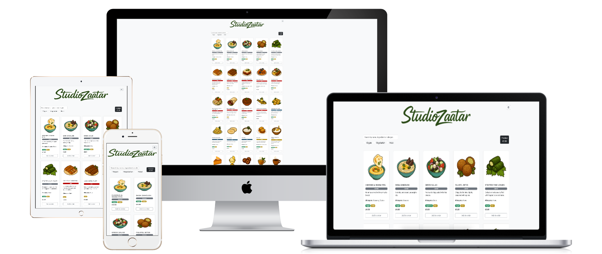
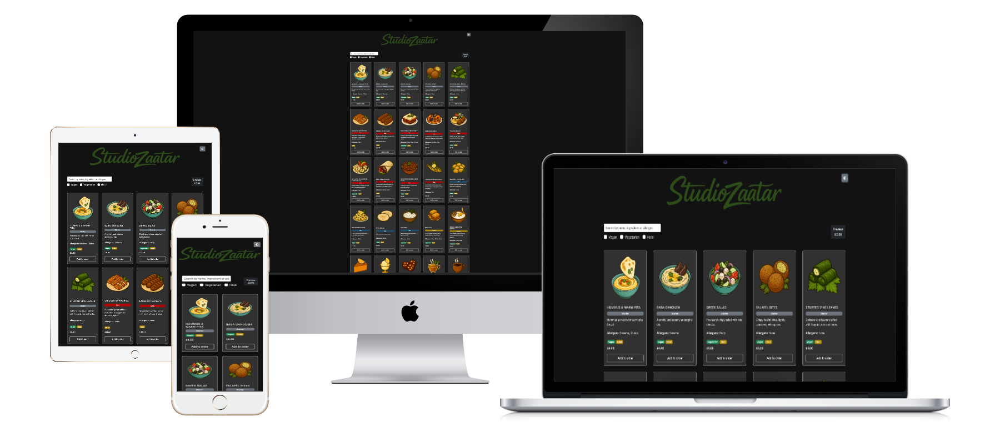
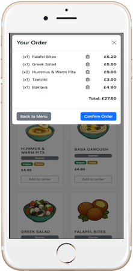
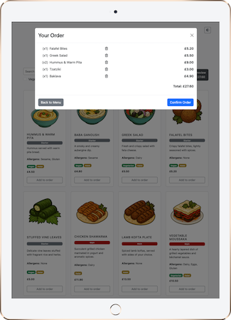
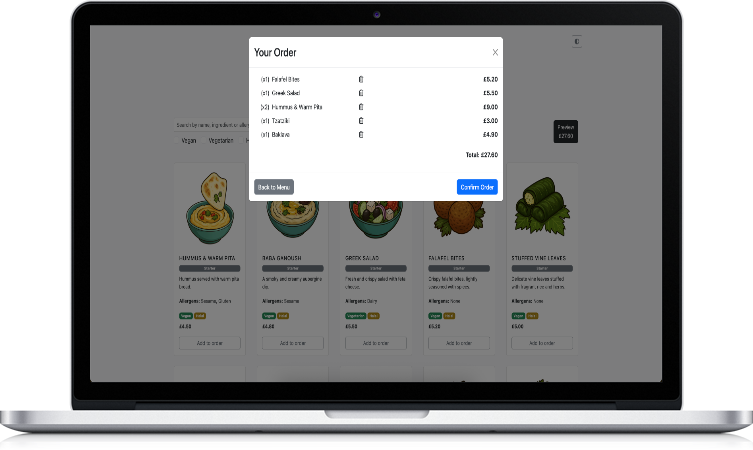
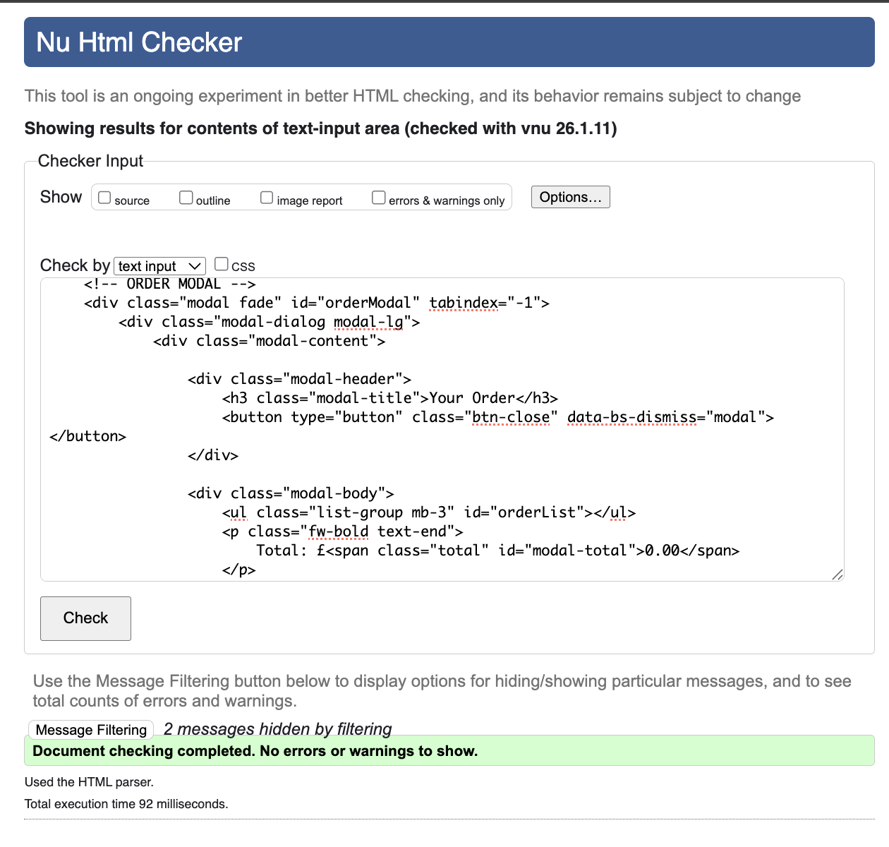
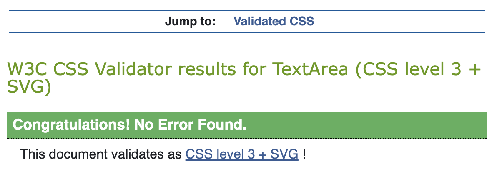

# Studio Zaatar – Interactive Restaurant Menu (JavaScript)

## 📌 Project Overview
 
 
 
 
 

This project is a **single-page interactive restaurant menu web application** built using **HTML, CSS, and vanilla JavaScript**.  
Users can browse menu items, filter by dietary preferences, search by keywords, add items to an order, and view a dynamically updated total.

The application focuses on **user experience, accessibility, responsiveness, and clean JavaScript logic**, following best practices taught during the WAES Full Stack Bootcamp.

---

## 📑 Table of Contents

- [Project Overview](#-project-overview)
- [User Value](#-user-value)
- [Features](#-features)
  - [Search & Filters](#-search--filters)
  - [Ordering System](#-ordering-system)
  - [Dark / Light Mode](#-dark--light-mode)
  - [Responsive Design](#-responsive-design)
- [Testing & Validation](#-testing--validation)
- [JavaScript Functionality](#-javascript-functionality)
- [Deployment](#-deployment)
- [Project Structure](#-project-structure)
- [AI Usage & Reflection](#-ai-usage--reflection)
- [Future Improvements](#-future-improvements)
- [Author](#-author)

---

## 🎯 User Value

This application allows users to:

- Quickly **search menu items** by name, ingredients, or allergens
- **Filter meals** by multiple dietary restrictions
- **Build an order dynamically** with quantity tracking
- See **real-time price updates**
- Switch between **Light and Dark mode**
- Use the app seamlessly on **mobile, tablet, and desktop**

---

## 🧩 Features

### 🔍 Search & Filters
- Live search across:
  - Meal name
  - Ingredients
  - Allergens
- Dietary filters:
  - Vegan
  - Vegetarian
  - Halal
- Filters and search work together dynamically

### 🛒 Ordering System
- Add menu items to an order
- Automatically increases quantity when the same item is added again
- Displays:
  - Item name
  - Quantity
  - Line price
- Remove items from the order
- Order total updates instantly

### 🌗 Dark / Light Mode
- Toggle between themes using JavaScript
- Theme change is applied using DOM manipulation
- Fully accessible toggle control

### 📱 Responsive Design
- Optimised for:
  - Mobile
  - Tablet
  - Desktop
- Layout adapts using:
  - Flexbox
  - Bootstrap utility classes
  - Media queries
  - JS functions

---

## 🧪 Testing & Validation

 
 ### ✅ HTML Validation
- Validated using **W3C HTML Validator**
- Screenshot:  
 

### ✅ CSS Validation
- Validated using **W3C Jigsaw Validator**
- Screenshot:  
 

### ✅ Lighthouse Testing
- Improvements made to improve Accessibility score:
  - Proper label associations
  - Semantic HTML
  - Accessible buttons and inputs
- Screenshot:
 

### ✅ JavaScript Linting
- JavaScript checked with a linter
- No syntax errors or warnings
- Clean, readable, and consistent code style

---

## 🧠 JavaScript Functionality

The project uses JavaScript to:

- Manipulate the DOM dynamically
- Handle user interactions
- Perform calculations
- Update UI state in real time

### Concepts used:
- `querySelector` / `querySelectorAll`
- Event listeners
- Event delegation
- Conditional logic (`if / else`)
- Loops (`forEach`)
- Dataset attributes
- Functions 

### Error Handling:
- Prevents duplicate order items
- Handles empty searches gracefully
- No console errors during runtime

---

## 🚀 Deployment

The project is deployed to a cloud hosting platform.

- Deployed version matches development version
- All features work after deployment
- No broken links or missing assets

**Live Site:**  
👉 https://filippo-ciucciomei.github.io/studio-zataar/

---

## 🗂️ Project Structure

<pre> 
studio-zaatar/
├── index.html
├── assets/
│ ├── css/
│ │ └── style.css
│ ├── js/
│ │ └── script.js
│ └── images/
│ ├── menu/
│ │ ├── falafel.png
│ │ ├── tzatziki.png
│ │ └── etc
│ └── readme/
│ ├── html-validator.png
│ ├── css-validator.png
│ └── lighthouse.png
└── README.md
</pre>

- HTML, CSS, and JavaScript are separated into external files
- Consistent naming conventions
- Clean and readable structure

---

## 🤖 AI Usage & Reflection

AI tools (ChatGPT & Copilot) were used throughout the development process to:

- Generate images
- Support JavaScript Logic
- Debug JavaScript logic
- Improve accessibility compliance
- Refactor and optimise UI behaviour
- Clarify JavaScript concepts and best practices
- Handle repetitive tasks (e.g. cards duplication)
- General tutoring

### Reflection

Using AI significantly improved productivity and learning efficiency.  
Rather than replacing understanding, AI was used as a **learning accelerator**, helping identify issues faster and explore better solutions while still requiring full comprehension and implementation by the developer.

---

## 📌 Future Improvements

- Improve filter logic to allow compound filtering
- Add payment page to finalise the order
- Allow the user to request changes on the single dish

---

## 👤 Author

**Filippo Ciucciomei**  
 
